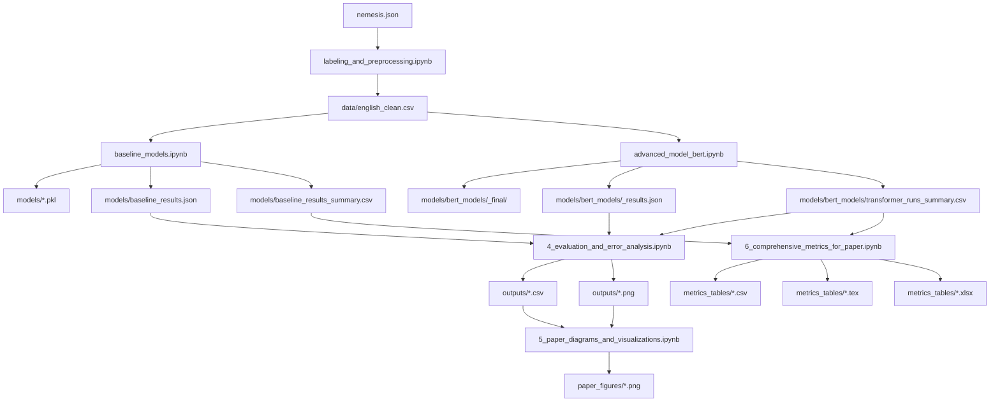

# PROJECT_SUMMARY — Darknet Trade Message Classification (Nemesis)

## 0) TL;DR

- **Task**: multi-class text classification of darknet marketplace listings (Nemesis) from English text.
- **End-to-end pipeline**: `nemesis.json` → preprocessing/labeling → TF‑IDF baselines → Transformer fine-tuning → evaluation & error analysis → paper-ready tables/figures.
- **Experiment tracking**: every Transformer run is saved under a unique `run_tag`, and the authoritative run ledger is `models/bert_models/transformer_runs_summary.csv`.

---

## 1) Repository Structure (what matters)

### Inputs

- `nemesis.json`: raw machine-readable pages.

### Processed dataset

- `data/english_clean.csv`: the cleaned dataset used across notebooks.

### Baseline artifacts

- `models/tfidf_vectorizer.pkl`
- `models/all_baseline_models.pkl`
- `models/baseline_results.json`
- `models/baseline_results_summary.csv`

### Transformer artifacts

- `models/bert_models/label_encoder.pkl`
- `models/bert_models/<run_tag>_final/` (model + tokenizer; typically `model.safetensors` + configs)
- `models/bert_models/<run_tag>_results.json`
- `models/bert_models/transformer_runs_summary.csv` (authoritative index; used by evaluation/metrics notebooks)

### Paper outputs

- `outputs/`: comparison tables, misclassification CSVs, and analysis artifacts.
- `paper_figures/`: generated PNG figures.
- `metrics_tables/`: paper-ready CSV/LaTeX/Excel tables.

---

## 2) Notebook Workflow (recommended run order)

1) `labeling_and_preprocessing.ipynb`
   - input: `nemesis.json`
   - output: `data/english_clean.csv`

2) `baseline_models.ipynb`
   - input: `data/english_clean.csv`
   - output: baseline artifacts under `models/`

3) `advanced_model_bert.ipynb`
   - input: `data/english_clean.csv`
   - output: run-tagged Transformer artifacts under `models/bert_models/` + `transformer_runs_summary.csv`
   - produces (typical):
     - `models/bert_models/label_encoder.pkl`
     - `models/bert_models/<run_tag>_final/` (final model + tokenizer)
     - `models/bert_models/<run_tag>_results.json` (eval metrics + config)
     - `models/bert_models/transformer_runs_summary.csv` (append a row per run)
     - (optional) intermediate folders like `*_finetuned/` created during training

4) `4_evaluation_and_error_analysis.ipynb`
   - input: baselines + best Transformer run(s)
   - output: `outputs/` (model comparison + error analysis)

5) `5_paper_diagrams_and_visualizations.ipynb`
   - input: `outputs/` and/or artifacts
   - output: `paper_figures/`

6) `6_comprehensive_metrics_for_paper.ipynb`
   - input: baseline artifacts + best Transformer run(s) resolved from `transformer_runs_summary.csv`
   - output: `metrics_tables/` (CSV/LaTeX/Excel)

---

## 2.1) Pipeline flow (high-level)

Notes:

- `transformer_runs_summary.csv` is treated as the authoritative ledger to resolve the “best run” for evaluation/metrics.
- `outputs/` is analysis-oriented; `paper_figures/` and `metrics_tables/` are paper-ready exports.

## 3) Key Engineering Changes (this session)

### A) Stable Transformer training + batch runs

- Added profile-based runs (FAST/COMPARE/PAPER) to make multi-model experimentation easier.
- Reduced brittleness from early-stopping in quick profiles.
- Standardized output layout:
  - `models/bert_models/<run_tag>_final/`
  - `models/bert_models/<run_tag>_results.json`
  - appended row in `models/bert_models/transformer_runs_summary.csv`

### B) Multi-run aware evaluation/metrics

- Evaluation/metrics notebooks were refactored to resolve “best model” from `transformer_runs_summary.csv` instead of hardcoding `bert_results.json` / `roberta_results.json`.
- Added resilience to CSV schema drift (some rows include an extra `run_profile` column).

### C) Paper diagrams robustness

- Fixed the `NameError: nx is not defined` by importing NetworkX.
- Added layout fallback (Graphviz → spring layout) so figures generate even without Graphviz installed.

### D) Windows stability for Transformer inference

- Batched inference to reduce peak memory pressure.
- Introduced a `SAFE_MODE` switch in the metrics notebook so it can default to a safer subset of Transformer models.
- Added guardrails around Windows paging-file failure mode (WinError 1455) to avoid kernel crashes.

---

## 4) Results (from repo artifacts)

### 4.1 Baselines (TF‑IDF + scikit-learn)

Source: `models/baseline_results_summary.csv` (test metrics)

| Baseline model | Accuracy (test) | F1 (test) |
|---|---:|---:|
| Linear SVM | 0.8756 | 0.7141 |
| Voting Ensemble | 0.8557 | 0.6636 |
| Logistic Regression | 0.8458 | 0.6469 |
| Gradient Boosting | 0.8159 | 0.6383 |
| Random Forest | 0.7861 | 0.6035 |
| Multinomial NB | 0.8507 | 0.5919 |

### 4.2 Transformers (fine-tuned)

Source: `models/bert_models/transformer_runs_summary.csv` (eval metrics)

| Model | Checkpoint | run_tag | eval_accuracy | eval_f1 |
|---|---|---|---:|---:|
| BERT (COMPARE) | `bert-base-uncased` | `bert_seed42_1769880355` | 0.8756 | 0.6968 |
| RoBERTa (COMPARE) | `roberta-base` | `roberta_seed42_1769881070` | 0.9055 | 0.7400 |

### 4.3 Lightweight Transformer experiments (advanced_model_bert)

Source: `models/bert_models/transformer_runs_summary.csv` (eval metrics)

These runs are useful when you want faster training/inference or reduced memory usage.

| Model | Checkpoint | run_tag | eval_accuracy | eval_f1 |
|---|---|---|---:|---:|
| DistilBERT | `distilbert-base-uncased` | `distilbert_seed42_1769876310` | 0.8060 | 0.4346 |
| DistilBERT | `distilbert-base-uncased` | `distilbert_seed42_1769876624` | 0.7861 | 0.3501 |
| DistilRoBERTa | `distilroberta-base` | `distilroberta_seed42_1769876756` | 0.8060 | 0.4671 |
| TinyBERT | `prajjwal1/bert-tiny` | `tinybert_seed42_1769876917` | 0.6269 | 0.2724 |
| MiniBERT | `prajjwal1/bert-mini` | `minibert_seed42_1769876927` | 0.5025 | 0.1797 |
| SmallBERT | `prajjwal1/bert-small` | `smallbert_seed42_1769876949` | 0.7761 | 0.3459 |
| ELECTRA-Small | `google/electra-small-discriminator` | `electra_small_seed42_1769877226` | 0.4527 | 0.1247 |

### 4.4 Paper-ready comprehensive metrics

Source: `metrics_tables/complete_metrics_summary.csv` and `metrics_tables/paper_summary_statistics.txt`

- **Evaluation metrics (from `complete_metrics_summary.csv`)**

| Model | Accuracy | Precision (Macro) | Recall (Macro) | F1 (Macro) | Cohen’s Kappa | MCC | ROC_AUC (Macro) |
|---|---:|---:|---:|---:|---:|---:|---:|
| Logistic Regression | 0.4925 | 0.2742 | 0.2243 | 0.1738 | 0.0823 | 0.1816 | 0.6238 |
| SVM | 0.5075 | 0.2677 | 0.2331 | 0.1880 | 0.1129 | 0.2137 | 0.5096 |
| Random Forest | 0.4627 | 0.2915 | 0.2059 | 0.1369 | 0.0202 | 0.0970 | 0.6078 |
| Gradient Boosting | 0.4478 | 0.1809 | 0.2015 | 0.1467 | 0.0061 | 0.0123 | 0.4977 |
| BERT | 0.8756 | 0.7279 | 0.6762 | 0.6968 | 0.8096 | 0.8105 | 0.9649 |
| RoBERTa | 0.9055 | 0.8757 | 0.7346 | 0.7400 | 0.8562 | 0.8570 | 0.9656 |

- **Best Model: RoBERTa**
  - Accuracy = 0.9055
  - F1_Macro = 0.7400
  - Cohen’s Kappa = 0.8562
  - MCC = 0.8570
  - ROC_AUC_Macro = 0.9656

Tables exported under `metrics_tables/`:

| Paper table | Files |
|---|---|
| Table 1 — Standard metrics | `metrics_tables/table1_standard_metrics.csv`, `metrics_tables/table1_standard_metrics.tex` |
| Table 2 — Advanced metrics | `metrics_tables/table2_advanced_metrics.csv`, `metrics_tables/table2_advanced_metrics.tex` |
| Table 3 — Confusion-matrix stats | `metrics_tables/table3_confusion_stats.csv`, `metrics_tables/table3_confusion_stats.tex` |
| Table 4 — Per-class (RoBERTa) | `metrics_tables/table4_per_class_roberta.csv`, `metrics_tables/table4_per_class_roberta.tex` |
| Table 5 — Significance tests | `metrics_tables/table5_significance_tests.csv`, `metrics_tables/table5_significance_tests.tex` |
| Full summary | `metrics_tables/complete_metrics_summary.csv`, `metrics_tables/complete_metrics_summary.xlsx`, `metrics_tables/paper_summary_statistics.txt` |

---

## 5) Paper Outputs Produced

### 5.1 Figures

Generated under `paper_figures/`:

- `fig1_system_architecture.png`
- `fig2_hierarchical_taxonomy.png`
- `fig3_attention_heatmap.png`, `fig3b_cls_attention.png`
- `fig4_shap_force_plot.png`, `fig4b_shap_waterfall.png`
- `fig5_performance_comparison.png`
- `fig6_confusion_matrix.png`, `fig6b_confusion_matrix_normalized.png`
- `fig7_error_analysis.png`
- `fig8_training_history_distilroberta.png` (training log-based; generated from `trainer_state.json`)

### 5.2 Evaluation + error analysis artifacts

Key files under `outputs/`:

- `all_models_comparison.csv`
- `misclassified_examples.csv`
- `low_confidence_predictions.csv`
- `top20_misclassified_for_paper.csv`
- `top20_misclassified_latex.txt`

### 5.3 Transformer run artifacts (advanced_model_bert)

All Transformer runs are stored under `models/bert_models/`.

- Best-run selection is driven by `models/bert_models/transformer_runs_summary.csv`.
- For each run_tag, expected outputs:
   - `models/bert_models/<run_tag>_final/`
   - `models/bert_models/<run_tag>_results.json`

---

## 6) Reproducibility Notes (Windows-focused)

### Environment

- OS: Windows
- Python: conda env (py310)
- GPU: CUDA supported (if available)

### Common failure mode: WinError 1455 (paging file)

If loading `model.safetensors` triggers `OSError: [WinError 1455]`, mitigation options:

- Close memory-heavy apps and restart the Jupyter kernel.
- Increase Windows virtual memory (paging file).
- Use batched inference and enable `SAFE_MODE` in `6_comprehensive_metrics_for_paper.ipynb`.

### Note: baseline metric mismatch across sources

Some baseline rows in `metrics_tables/complete_metrics_summary.csv` may look abnormally low compared to `models/baseline_results_summary.csv`.

The typical cause is **label-index mapping inconsistency** between baseline evaluation and Transformer label encoding. For paper reporting:

- Treat `models/baseline_results_summary.csv` as the authoritative baseline summary.
- Ensure any “unified” evaluation uses label strings consistently, or a single shared label encoder.

---

## 7) Paper checklist

- [x] Cleaned dataset: `data/english_clean.csv`
- [x] Baselines trained + summarized: `models/baseline_results_summary.csv`
- [x] Transformers trained + tracked: `models/bert_models/transformer_runs_summary.csv`
- [x] Evaluation + error analysis: `outputs/`
- [x] Figures generated: `paper_figures/`
- [x] Paper tables generated: `metrics_tables/`

---

Generated: 2026-01-31
